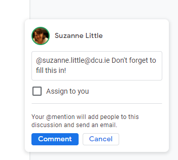

# Skill: Google Docs

**Summary:** Google Docs is an online document editing platform with similar functionality to Microsoft Word that saves documents to google drive so they can be collaboratively edited.  

**Data formats in:** gdoc, docx, pdf, txt, rtf, odt, html  
**Data formats out:** docx, odt, pdf, rtf, txt, html, epub  

**Three tips:**
1. Use Headings to create an automatic table of contents or navigation pane.  
2. Ctrl-K will bring up the option to turn selected text into a hyperlink (to other google docs or any URL).  
3. You can include @email-address to assign a comment to another user (or to yourself) and they will be notified.  

**Examples of use:**

**Contribution to data analytics pipeline:** Google Docs is useful for recording and reporting (Data Presentation) and sometimes can be a format or place that data is stored in (Data Gathering).

**Comment on your skill level:** My current level is 9/10. I use Google Docs frequently for my work and know many shortcuts to using it efficiently. To get better I would need to make more use of templates and different formatting of documents.  
