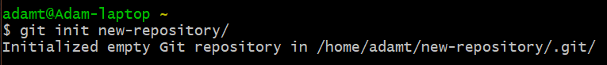
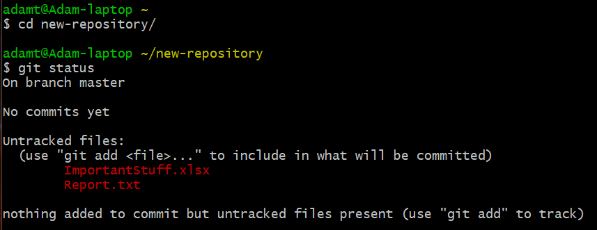

# Skill name: Using Git for version-control

**Summary:** Git is a version-control system which tracks changes to files and allows for easy collaboration between programmers.

**Data formats in:** png, jpg, gif, zip, pdf, mp4, mp3, csv, msg, html, md, txt (All file types, but some features only work with plain text files).   
**Data formats out:**  All files git accepts are stored as that file. git diff and other features will only work with plain text files however.   

**Three tips:**
1.  When committing staged files you can add the -m flag followed by a message in quotation marks to avoid opening a text editor. e.g. git commit -m "message".
2.  git checkout -- filename can be used to undo any changes made to a file since your last commit.
3.  You can use git init in a directory that is not yet a git repository to convert it to one, or git init path/to/file to turn a specific file into a git repository.

**Examples of use:**

   

**Contribution to data analytics pipeline:** Git is useful for keeping previous versions of your files and making them hard to lose (Data Preservation) and also allows you to quickly return to previous versions should you make a mistake (Data Processing).

**Comment on your skill level:** My current level is 6/10. I haven't been using git long and only really use basic functionality. To improve I would like to learn more about some of the more advanced functionality and also become more efficient with using shell commands to speed up my git processes.
