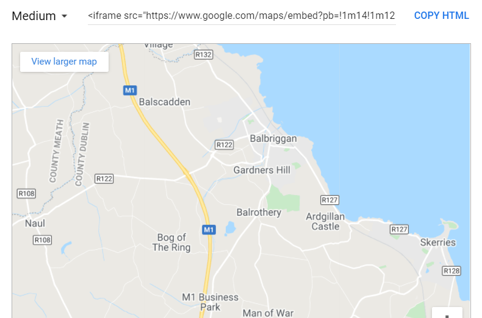

# Skill name: HTML

**Summary:** HTML stands for Hyper Text Markup Language and it is the standard format for all web-pages on the internet.

**Data formats in:**  HTML can make use of png, jpeg, mp3, mp4 and many other files that are pictures or videos that are embeded in a web-page.   
**Data formats out:**  HTML pages provide links to download files or any type and can threrfore export any type if need be.

**Three tips:**  

1.  HTML makes use of tags to signal the start and end of text to create a HTML element. e.g. <> with a h1 inside followed by </> with another h1 inside this tag creates an element(I can't do it as it makes a heading). You then put the text inbetween the tags.
2.  You can make stylesheets for your HTML files using css. This gives you control of the colour of backgrounds, you can add borders, change text sizes and colours. You can reuse stylesheets across multiple HTML pages to keep the same style.
3.  On Youtube and Google Maps you can get the code to embed them into your webpage when you go to share a video or a map. This can add a lot to your webpage.

**Examples of use:**

   

**Contribution to data analytics pipeline:** HTML can be used in the data gathering stage as the medium by which you run your survey if it is online. It can also be useful for presenting the data as it can be editing to look any way you want it to.

**Comment on your skill level:** My current level is 5/10. Although I have never formally learnt HTML,  I know about much of the functionality it offers through projects with CA and EC students. I fell as though I could piece together a decent web-page if I looked up some documentation.
