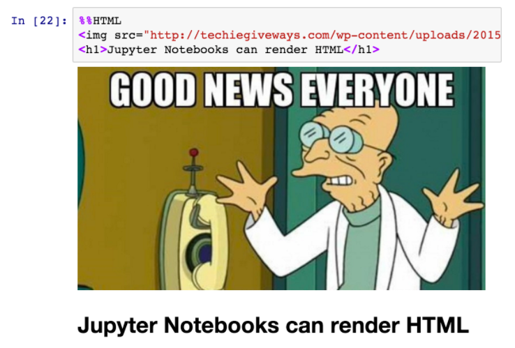

# Skill name: Jupyter Notebooks

**Summary:** Jupyter Notebooks allow for the creation of documents that contain live code that can be easily narrated and can also contain visualizations.

**Data formats in:**  primarily ipynb, but can open txt, pdf, py and many other common files for editing (must be UTF-8 Encoded).   
**Data formats out:**  any of the editable text files and of course ipynb files.

**Three tips:**  
1.  You can change a cell from a code cell to a markdown cell and use markdown to document your code to make it easy to follow.
2.  You can use ctrl + enter to run the selected cell and stay there, or you can use ctrl + shift to run the current cell and move to the next one.
3.  Using %%lsmagic returns a list of all available line or cell magics, these include the ability to time processes in different ways, or to run a cell in a certain language like HTML, bash, JavaScript, ruby and perl. e.g. %%HTML and then fill the cell with html.

**Examples of use:**

   

image via: https://blog.dominodatalab.com/lesser-known-ways-of-using-notebooks/  

**Contribution to data analytics pipeline:** Jupyter Notebooks allow for step by step data processing and cleaning. As it runs Python, it can use libraries such as pandas to integrate data and can be used to manipulate and remove artefacts. In addition, analyzation can be easily done in python and the huge amount of visualization libraries will cover any presentation needs.

**Comment on your skill level:** My current level is 7/10. Having just discovered magics, I have a wider range of options available to me. Although Python is my strongest language by a mile, it will be useful when I get more familiar with other languages to integrate them into the one notebook.
