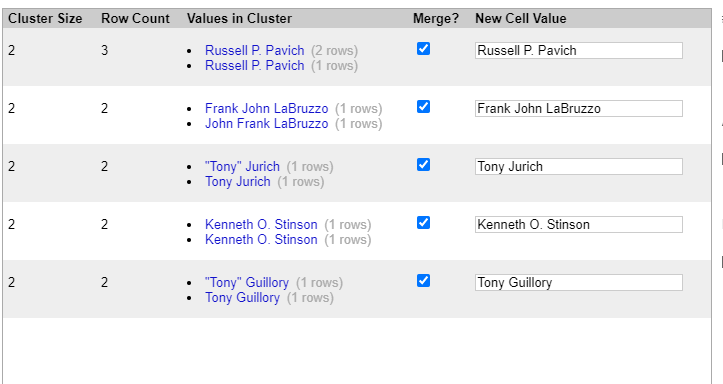

# Skill name: OpenRefine

**Summary:** OpenRefine is a powerful tool for working with messy data, it allows for quick sanity checks and easy manipulation of large chunks of data to quickly detect errors and remove artefacts.

**Data formats in:**  tsv, csv, xls, xlsx, json, xml and google spreadsheets.   
**Data formats out:**  tsv, csv, HTML table, xls, xlsx, odf, tar.gz

**Three tips:**  
1.  Clicking on a column and using edit cells, common transforms and picking a type, i.e. to numeric, changes all entries in that column to that type.
2.  Clicking on a column and picking a facet allows you to see a histogram of all values of that type. i.e. using a numeric facet on a column of numbers helps to identify outliers. It also shows non-numerics and errors so you can find artefacts.
3.  Cluster and edit can be used on a column to find strings that are very similar that may be seen as the same in your eyes. It also allows you to quickly change these to a common name, making the data cleaner.

**Examples of use:**

   

**Contribution to data analytics pipeline:** OpenRefine plays a big role in cleaning data by triming whitespace, finding artefacts in the data and removing duplicate entries (Data Processing).

**Comment on your skill level:** My current level is 8/10. I don't have tons of experience with OpenRefine, but I have made good use of it in A3. I know what OpenRefine is capable of and have used most of the functions it offers in some way.
