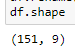
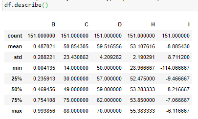

# Skill name: Pandas

**Summary:** Pandas is a Python library which is used for data manipulation and analysis mainly because of its dataframes and the large range of functions it provides.

**Data formats in:**  csv, json, html, ods, hdf5, xls, xlsx, xlsb, pkl, feather, parquet, orc and SQL tables
**Data formats out:**  csv, json, html, hdf5, xls, xlsx, pkl, feather, parquet and as a SQL table

**Three tips:**  

1.  When you first load in a dataframe you should typically use df.head(), where df is the name of your dataframe, to show the first 5 rows so you know the data has been read correctly.
2.  df.shape gives the count of rows and columns and df.describe() gives some basic summary statistics. These are both very useful when doing sanity checks as you know exactly how many rows there are and the max statistic can help to pick out absurd values.
3.  When you want to export a dataframe as a csv you can use df.to_csv() function and pass it a path to save the csv to. Additional arguments can be used such as na_rep="" which tell the function to replace null values with this string.

**Examples of use:**

  

**Contribution to data analytics pipeline:** Pandas is useful for organizing data into a structured form, cleaning it and integrating it (Data Processing). It also can arrange data using pivots which allow for easier analyzation and visualization of the data.

**Comment on your skill level:** My current level is 7/10. I understand the uses of Pandas and have used it many times over in CA273 and even for other modules. I know how to use many of the functions, but could use more practice to become more comfortable with them and eliminate silly bugs in my dataframe manipulations.
