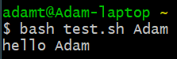

# Skill name: Scripting

**Summary:** Scripting is typically a way to automate common tasks, complete tasks in batches and run applications through the use of scripts written in a scripting language like Python, JavaScript or Bash etc.

**Data formats in:**  scripts can take any text files as input and even binary if it has access to the right libraries or applications to use them.   
**Data formats out:**  In the same way as input, both text and binary files can be outputted by scripts assuming they have access to the right libraries or applications.

**Three tips:**  
1.  When in a bash terminal working interactively (line by line), you can use > after your command and then a file name to store the output under that file name. The same goes for using input, you can use < followed by a filename to give it as input to a process. e.g python3 test.py < input.txt > results.txt will pass input.txt as input to test.py and store the results in results.txt.
2.  For batch processing in batch you can use a for loop. This is structured like this, for file in home/*.csv; do echo $file; done. This will print every csv file in the home directory. You can edit it to edit the file in a certain way or move it etc. which is useful for using one command to do the same thing to multiple files.
3.  In a bash script you can use $@ as a placeholder for a variable you want the user to input when running the program on the command line as an additional argument. so bash test.sh Adam would pass the string "Adam" to the script test.sh which would replace the $@ in the script.

**Examples of use:**

   

**Contribution to data analytics pipeline:** Scripting languages can be used to integrate data and manipulate text files easily (Data Processing). In addition, it can be great for general use to get the data into a specific form to allow for easy analysis and presentation.

**Comment on your skill level:** My current level is 8/10. I have a good grasp of Python and I know enough bash to get me by. I could improve by getting more comfortable with bash and learning some other scripting languages.
