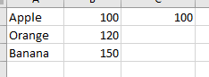

# Skill name: Spreadsheets

**Summary:** Spreadsheets are a way of organizing data and quickly being able to analyze it with function in many spreadsheet programs like Excel and Google Sheets.

**Data formats in**  csv, tsv, dif, ods, xls, xlsx, xml (to name a few, any typical spreadsheet file with rows and columns). Only excel workbook files can be used to store functions. files like csv will only contain the values.
**Data formats out**  all mentioned above and also txt files and pdf. As mentioned previously, if exporting as a csv, the functions used in the spreadsheet will not be saved.

**Three tips:**  
1.  The WEEKDAY function can be passed a date and an arrangement type (1, 2 or 3, gives the days different numbers) and it will return a number which corresponds to a particular day in the week.
2.  The functions COUNTIF and SUMIF  can be given a range and a criteria to match, any cells that match these criteria are either counted or the values are summed depending on which function you use.
3.  VLOOKUP is a function that searches a given tables leftmost column for a given value and can return any value from that row of the table.

**Examples of use:**

    

**Contribution to data analytics pipeline:** Spreadsheets act as a nice way to view your data in an organized way and function allow for easy sanity checks and calculations (Data Processing). Spreadsheets also act as a way of storing data once it has been finished with (Data Preservation). Programs such as excel also allow for data visualizations with simple and easy to make visualizations.

**Comment on your skill level:** My current level is 7/10. I understand the uses of spreadsheets and what can be done using them. I believe I would have a much better understanding if I used it regularly and knew some of the more advanced functionalities spreadsheets offer.
