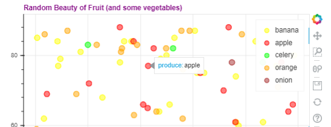

# Skill name: Python Visualization (matplotlib, seaborn or bokeh)

**Summary:** Python has a wide range of libraries for visualization which provide many different features from maps, interactive visualizations or just visually appealing ones.

**Data formats in:**  mainly txt files like txt, csv, tsv that values to be put on the visualization can be easily extracted.   
**Data formats out:**  png, jpeg, gif and even mp4 with the use of other libraries.

**Three tips:**  
1.  matplotlib has a module called pyplot that can be use with other visualization libraries to add titles, ticks and much more which adds more depth to your visualizations.
2.  seaborn provides a wide range of plot types. using catplot you can pass the argument kind="" and say swarm for a unique scatterplot, count for sets of bars and much more.
3.  Bokeh provides interactive visualizations that can be explored by the viewer. Using variable you can set tooltips that appear with information when you hover over certain point on a visualization.

**Examples of use:**

   

* ([My Bokeh Notebook](visualization.ipynb))

**Contribution to data analytics pipeline:** These Python libraries are used primarily to display the data in a way it can be better understood. This would mean that they contribute mainly to the analysis of the data and the presentation of the meaning the data has.

**Comment on your skill level:** My current level is 6/10. I don't have as much experience using these libraries as I would like. I have over this year gained a decent understanding of what is capable with them and can typically find what I want to do through reading the documentation.
